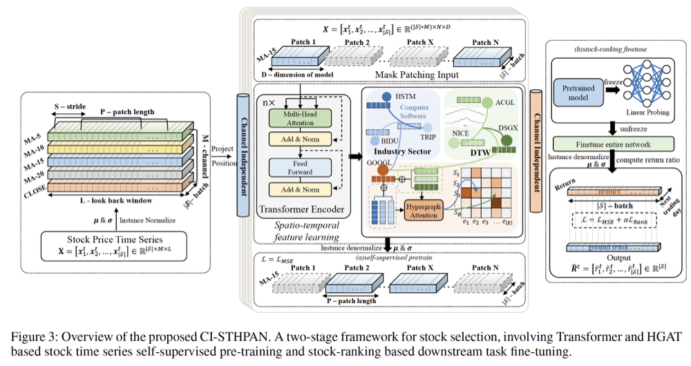

# Channel-Independent Based Spatio-Temporal Hypergraph Pre-Trained Attention Networks for Stock Selection



Quantitative stock selection is one of the most challenging FinTech tasks due to the non-stationary dynamics and complex market dependencies. Existing studies rely on channel mixing methods, exacerbating the issue of distribution shift in financial time series. Additionally, complex model structures they build make it difficult to handle very long sequences. Furthermore, most of them are based on predefined stock relationships thus making it difficult to capture the dynamic and highly volatile stock markets. To address the above issues, in this paper, we propose Channel-Independent based Spatio-Temporal Hypergraph Pre-trained Attention Networks(CISTHPAN), *a two-stage framework for stock selection, involving Transformer and HGAT based stock time series self-supervised pre-training and stock-ranking based downstream task fine-tuning.* We calculate the similarity of stock time series of different channel in dynamic intervals based on Dynamic Time Warping(DTW), and further construct channel independent stock dynamic hypergraph based on the similarity. Experiments with NASDAQ and NYSE markets data over five years show that our framework outperforms SOTA approaches in terms of investment return ratio (IRR) and Sharperatio (SR). Additionally, we find that even without introducing graph information, self-supervised learning based on the vanilla Transformer Encoder also surpasses SOTA results.Notable improvements are gained on the NYSE market. It ismainly attributed to the improvement of fine-tuning approach on IC and ICIR, indicating that the fine-tuning method enhances the accuracy and stability of the model prediction.

## Install environment

Init environment using conda

```
conda create -n ci-sthpan python=3.10.12

conda activate ci-sthpan
```

Install pytorch

```
conda install pytorch torchvision torchaudio pytorch-cuda=11.8 -c pytorch -c nvidia
```

Install torch geometric: Please follow [these instructions](https://pytorch-geometric.readthedocs.io/en/latest/notes/installation.html).
For our environment, we use the command:

```
conda install pyg -c pyg
```

Install other packages:

```
pip install -r requirements.txt
```

## Data & Models

Datasets: [Link](https://pan.baidu.com/s/12SgBKg50pG-F3SpQA_x0tQ) Code: 2vqs

Pretrained models：[Link](https://pan.baidu.com/s/1HGJ0sAriVLRhc7KqkLC51w) Code: h729

## Example

Pre-training and fine-tuning of hypergraphs constructed based on wikidata relations on NASDAQ is shown here as an example.

### Pretrain

```
bash ./PatchTST_self_supervised/scripts/pretrain/pre_graph_wiki.sh
```

### Finetune

```
bash ./PatchTST_self_supervised/scripts/finetuned/[27]graph_wiki.sh
```


